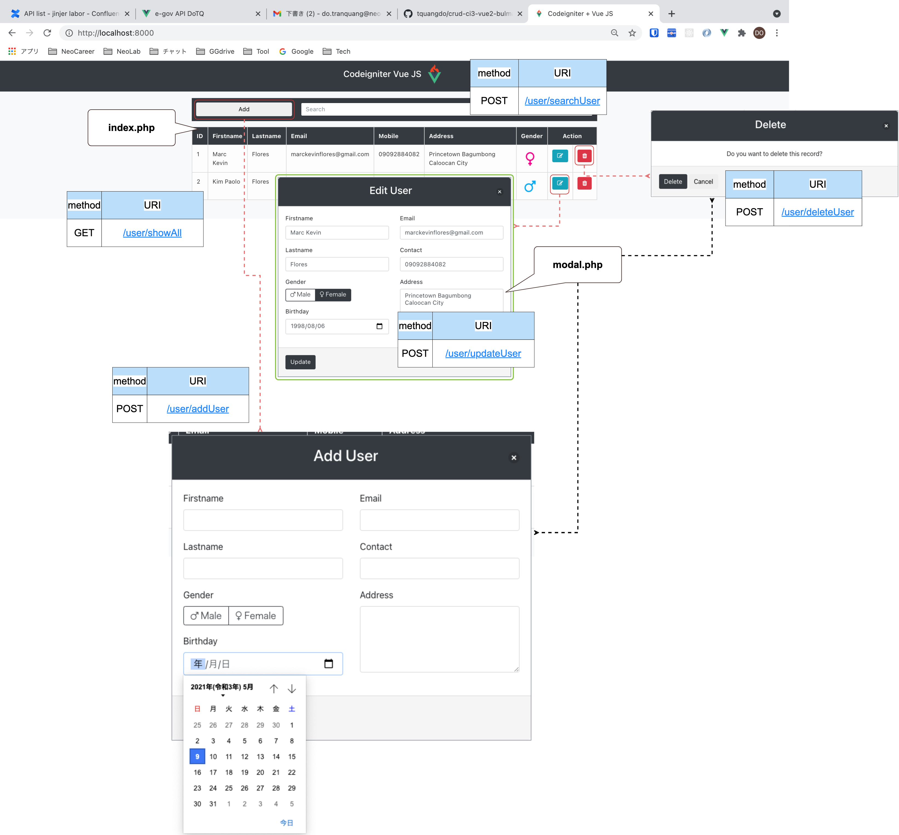

# CRUD List 🎇

## deploy local
1. docker compose up -d
2. access browser `localhost:8000`

## version
1. PHP version : 7.0
2. Codeigniter version: 3.1.6
3. Vue JS version: v2.5.17-beta.0

**********
Functions:
**********
1. Create
2. Read
3. Edit
4. Delete
5. Search
6. Pagination

********
Include:
********
1. Bootstrap 4 - for Design
2. Bulma - for Modal
3. Animate CSS - for animation design
4. Font Awesome - for cool icons
5. Jquery - need for bootstrap but not use
6. Axios - AJAX/HTTP library

